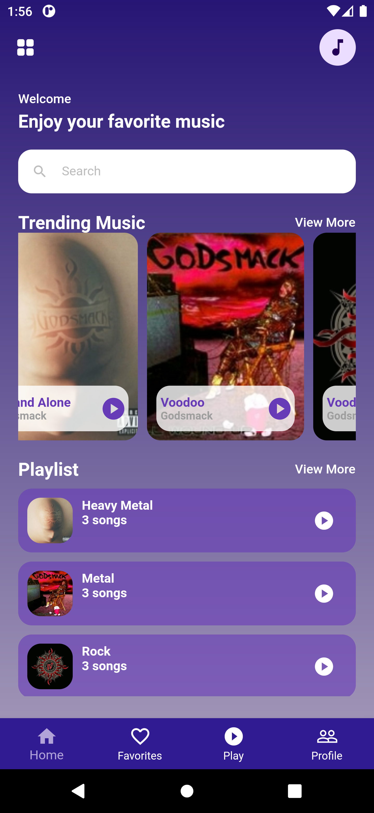
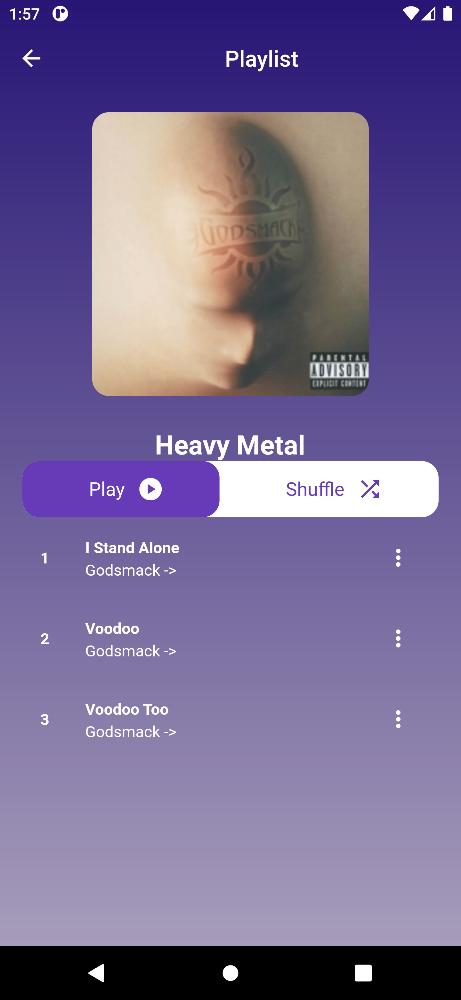
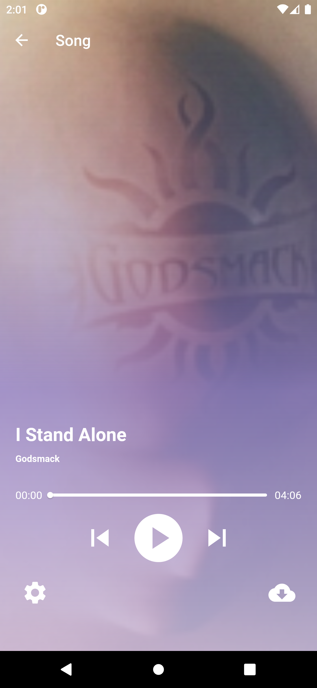

# Music Player

## SDK Version
Flutter: 3.13.0
Dart: 3.1.2

# The Project:

You can run this project:

1. Direct on Android Studio Emulator by this [link](https://github.com/RashadZA/audio_player)
2. Physical Device. [Apk_link](https://drive.google.com/file/d/143T1iH-QPHeD-bhwKGHdVbRV3maOOEla/view?usp=sharing)
3. 
### Plan
Build an App for Music player.

### Progress
First part of UI done.

# Dependencies:
* get
* rxdart
* just_audio

# Permission:
* For now not required.

# How to Use the Project:

* Just install and open app.

## APP Screenshots:

